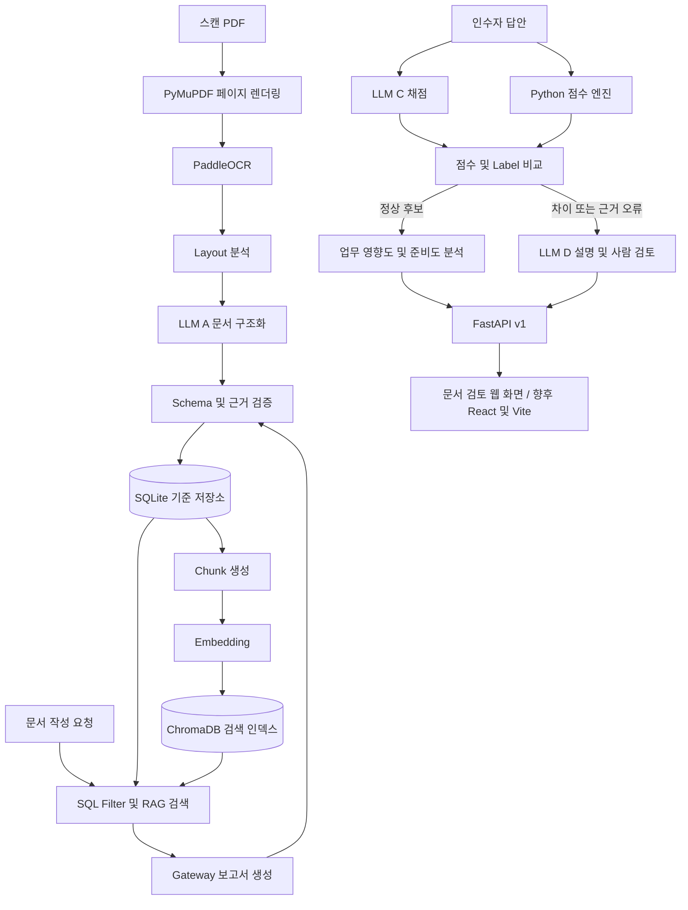

# 시스템 아키텍처

이 문서는 `docs/develop.md`의 개발 계획을 실제 코드 경계로 정리한 구현 아키텍처 이다.
외부 런타임보다 도메인 계약이 안쪽에 위치하는 Ports and Adapters 구조를 사용한다.

## 전체 흐름



## 계층과 의존 방향

```
API → Services → Domain
         ↓
       Ports ← Adapters
```

| 계층 | 책임 | 현재 상태 |
|---|---|---|
| `api` | 버전 API, 요청 검증, 응답 변환 | Health·Architecture·점수 비교·문서 등록/조회·OCR 실행/상태/결과 구현 |
| `services` | 여러 도메인 규칙과 포트를 유스케이스로 조합 | 평가 비교·문서 등록·OCR 처리·페이지 구조/Chunk 생성 구현 |
| `domain` | 표준 JSON Schema, 점수 및 업무 분석 규칙 | 핵심 계약 구현 |
| `ports` | LLM·Repository·Vector Store 계약 | Protocol 구현 |
| `adapters` | SQLite·Ollama·ChromaDB·OCR 실제 연동 | SQLite 문서/OCR/Chunk Repository·PDF 검사/렌더링·PaddleOCR 구현 |
| `web` | 문서 입력 및 원문 검토 | HTML/CSS/JS 화면; OCR 검토·근거 준비/조회·원문 강조 |

도메인과 서비스는 Ollama, ChromaDB, PaddleOCR의 응답 객체를 직접 참조하지 않는다.
외부 결과는 어댑터가 표준 Schema로 변환한다.

## 저장소 책임

SQLite는 문서와 OCR 원문, 계층 구조, Chunk 메타데이터, 근거 연결, 생성 실행 이력의 기준 저장소이다.
ChromaDB는 재구축할 수 있는 검색 인덱스이며 기준 데이터로 사용하지 않는다.

```
Local File Store
├─ 원본 PDF
└─ 렌더링한 페이지 이미지

SQLite
├─ Ingestion / Document / Page
├─ Section / DocumentBlock
├─ Chunk / ChunkSource
└─ GenerationRun

ChromaDB
└─ 실행별 Chunk ID + Embedding (원문·공개 여부는 SQLite에서 검증)
```

문서 변경 또는 OCR 재실행 시 새로운 `ingestion_id`를 만든다.
인덱스는 `pending → ready` 상태가 된 버전만 검색에 노출하고 실패한 인덱스는 SQLite와 원본 파일에서 재구축한다.

## LLM 역할과 Gateway

논리 역할은 최대 네 개지만 같은 로컬 모델을 역할별 설정으로 재사용할 수 있다.

| 역할 | Gateway 메서드 | 출력 |
|---|---|---|
| 문서 구조화 | `extract_document` | 구조화된 업무 및 문서 정보 |
| 문제 생성 | `generate_question` | 문제·정답·Rubric·근거 |
| 답안 평가 | `evaluate_answer` | 기준별 점수와 답안 근거 |
| 차이 설명 | `explain_difference` | 점수 차이 설명과 검토 정보 |

보고서 생성은 기존 Gateway의 `generate_report`를 사용하며 별도 다섯 번째 모델을 요구하지 않는다.
Provider 호출 전후의 모델 ID, Prompt·Schema 버전, 검색 근거 ID, 처리 시간과 결과 상태를 `generation_run`에 남긴다.

## 검증 경계

- LLM 출력은 Pydantic 검증 전까지 신뢰하지 않는다.
- 인수인계서의 모든 내용은 등록된 `evidence_id`를 참조해야 한다.
- LLM이 만든 SQL은 실행하지 않고 미리 정의된 Query만 매개변수화해 실행한다.
- 두 점수가 모두 있고 Label이 같으며 점수 차이가 5 이하인 경우만 자동 처리 후보로 둔다.
- 자동 처리 후보는 실제 인수인계 완료 승인이 아니며 담당자의 최종 판단을 대체하지 않는다.

## 단계별 구현 순서

1. [완료] SQLite 문서 Repository와 문서 등록 트랜잭션, 목록·상세 API를 구현한다.
2. [구현] PyMuPDF·PaddleOCR 어댑터, 작업 상태/재처리 API와 합성 스캔 Fixture를 연결했다.
   OCR 결과는 페이지·좌표·신뢰도와 함께 저장하며 Layout 분석은 후속 작업이다.
3. [기본 구현] 페이지별 Section·Chunk·원문 근거 연결과 검토 화면을 구현했다.
   페이지 fallback과 좌표 규칙 기반 Layout 분석을 별도 버전으로 제공한다.
   제목/표/다단은 검토가 필요한 제안이며 셀 복원과 실제 문서 품질 평가는 후속이다.
   ChromaDB 색인 상태 전이·구조별 검색·원문 이동도 구현했다. 상세는
   [검색 색인](search-indexing.md)을 참고한다.
4. [발췌 초안 구현] Ollama Gateway·JSON Schema·제한 재시도와 생성 이력을 연결했다.
   원문 ID를 선택하여 본문을 서버에서 조립한다. 실모델 추론 검증과 다른 역할 확장은 후속이다.
5. RAG 보고서 생성, 문제 생성, 답안 평가를 순서대로 연결한다.
6. 준비도·추천 계산과 React UI를 추가한다.
   문서 등록·OCR 원문 검토용 최소 화면은 먼저 구현했다. 전체 작성 UI는 후속 작업이다.
7. 장애 주입, 모델 교체, 근거 추적 전체 흐름을 Golden Test로 검증한다.

구조 버전은 `structure_run`과 `structure_section`으로 관리한다. 기존 원문 Block을
덮어쓰지 않고 과거 근거를 보존한다. 상세 규칙은 [문서 구조](document-structure.md),
후속 작업별 완료 기준은 [다음 작업 계획](next-steps.md)을 참고한다.
